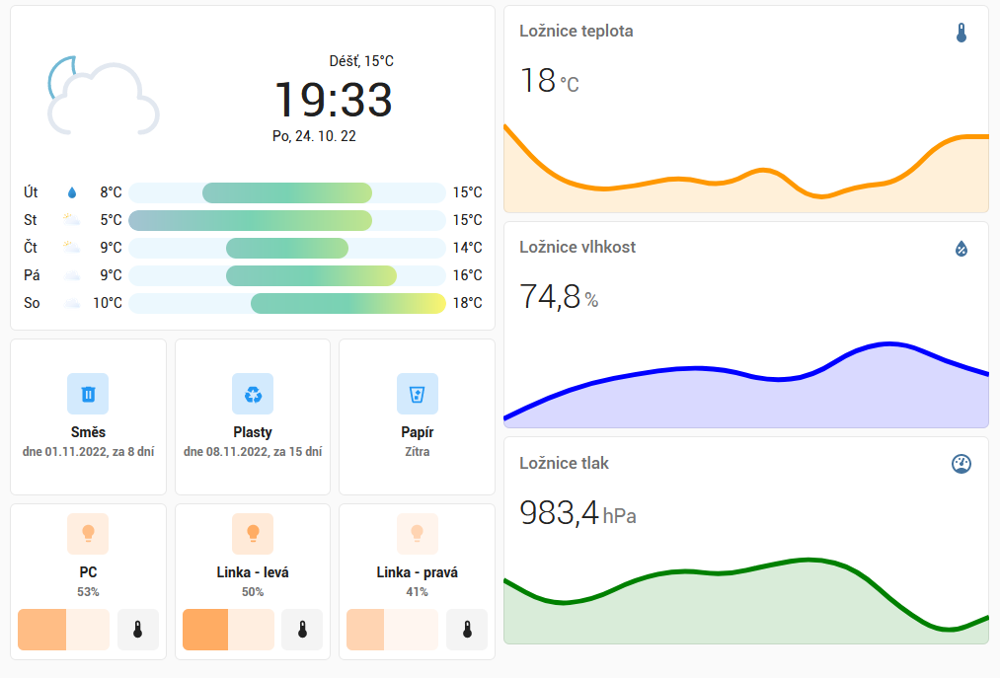

# Kuca home-assistant-config

[](https://github.com/kuca171/home-assistant-config/commits/main)
[](https://github.com/home-assistant/core/releases/tag/2023.2.4)
[](https://community.home-assistant.io/u/kuca171/summary)



Mé konfigurační soubory pro [Home Assistant](https://home-assistant.io/).

### Do budoucna plánuji

- [ ] Přidání LED pásků (rozpracováno -> Wemos d1 mini) -> FoxHomeIoT
- [ ] Solární venkovní meteostanice (rozpracováno -> Wemos d1 mini + BME280) -> FoxHomeIoT

# Obsah

- [Použité zařízení](#použité-zařízení)
- [Doplňky](#doplňky)
- [Hacs integrace a témata](#hacs-integrace-a-témata)
- [Automatizace](#automatizace)
- [Další projekty](#další-projekty)

# Použité zařízení

<!-- start-table -->

<table>
  <thead>
    <tr>
      <th>Server</th>
      <th>Počet kusů </th>
      <th></th>
    </tr>
  </thead>
  <tbody>
    <tr>
      <td>Raspberry Pi 4 Model B - 2GB RAM</td>
      <td>1</td>
      <td></td>
    </tr>
    <tr>
      <td><s>Samsung EVO Plus microSDXC 64GB MB-MC64HA/EU</s></td>
      <td><s>1</s></td>
      <td></td>
    </tr>
    <tr>
      <td>Verbatim Vx500 SSD 120GB</td>
      <td>1</td>
      <td></td>
    </tr>
  </tbody>
  <thead>
    <tr>
      <th>Světla</th> 
      <th>Počet kusů</th>
      <th>Použitá integrace</th>
    </tr>
  </thead>
  <tbody>
    <tr>
      <td>Solight LED SMART WIFI RGB žárovka (wz432)</td>
      <td>3</td>
      <td><a href="https://github.com/rospogrigio/localtuya/">localtuya</a></td>
    </tr>
  </tbody>
  <thead>
    <tr>
      <th>Zásuvky</th> 
      <th>Počet kusů</th>
      <th>Použitá integrace</th>
    </tr>
  </thead>
  <tbody>
    <tr>
      <td>Zásuvková lišta - LEDVANCE MULTI POWER SOCKET EU</td>
      <td>1</td>
      <td><a href="https://github.com/rospogrigio/localtuya/">localtuya</a></td>
    </tr>
  </tbody>
  <thead>
    <tr>
      <th>Senzory</th>
      <th>Počet kusů</th>
      <th>Použitá integrace</th>
    </tr>
  </thead>
  <tbody>
    <tr>
      <td>ESP32 + BME280</td>
      <td>1</td>
      <td><a href="https://github.com/kuca171/FoxHomeIoT-ESP">FoxHomeIoT</a></td>
    </tr>
  </tbody>
  <thead>
    <tr>
      <th>Kamery</th>
      <th>Počet kusů</th>
      <th>Použitá integrace</th>
    </tr>
  </thead>
  <tbody>
    <tr>
      <td>ESP32-cam</td>
      <td>1</td>
      <td>Postupná migrace -> FoxHomeIoT</td>
    </tr>
  </tbody>
  <thead>
    <tr>
      <th>Ostatní</th>
      <th>Počet kusů</th>
      <th>Použitá integrace</th>
    </tr>
  </thead>
  <tbody>
    <tr>
      <td>Odvlhčovač vzduchu Concept OV2220 Perfect Air Smart</td>
      <td>1</td>
      <td><a href="https://github.com/rospogrigio/localtuya/">local tuya</a></td>
    </tr>
  </tbody>
</table>
<!-- end-table -->

# Doplňky

Použité doplňky [Supervisora](https://www.home-assistant.io/getting-started/):

<!-- start-table -->

<table>
  <thead>
    <tr>
      <th>Název doplňku</th>
    </tr>
  </thead>
  <tbody>
    <tr>
      <td><s><a href="https://github.com/esphome/esphome">ESPhome</a></s></td>
    </tr>
    <tr>
      <td><a href="https://github.com/home-assistant/addons/tree/master/configurator">File editor</a></td>
    </tr>
    <tr>
      <td><a href="https://github.com/sabeechen/hassio-google-drive-backup">Home Assistant Google Drive Backup</a></td>
    </tr>
    <tr>
      <td><a href="https://github.com/hassio-addons/addon-grafana/">Grafana</a></td>
    </tr>
    <tr>
      <td><a href="https://github.com/hassio-addons/addon-influxdb/">InfluxDB</a></td>
    </tr>
    <tr>
      <td><a href="https://github.com/home-assistant/addons/tree/master/mariadb">MariaDB</a></td>
    </tr>
    <tr>
      <td><a href="https://github.com/home-assistant/addons/tree/master/mosquitto">Mosquitto broker</a></td>
    </tr>
    <tr>
      <td><a href="https://github.com/hassio-addons/addon-node-red">Node-RED</a></td>
    </tr>
    <tr>
      <td><s><a href="https://github.com/hassio-addons/addon-phpmyadmin">phpMyAdmin</a></s></td>
    </tr>
    <tr>
      <td><a href="https://github.com/hassio-addons/addon-ssh">SSH & Web Terminal</a></td>
    </tr>
    <tr>
      <td><s><a href="https://github.com/hassio-addons/addon-vscode/">Studio Code Server</a></s></td>
    </tr>
  </tbody>
</table>

<!-- end-table -->

# Hacs integrace a témata

Použité integrace a témata vzhledu z [HACS](https://hacs.xyz/):

<!-- start-table -->

<table>
  <thead>
    <tr>
      <th>Název</th>
    </tr>
  </thead>
  <tbody>
    <tr>
      <td><s><a href="https://github.com/jcwillox/hass-auto-backup">Auto backup</a></s></td>
    </tr>
    <tr>
      <td><a href="https://github.com/bruxy70/Garbage-Collection/">Garbage Collection</a></td>
    </tr>
    <tr>
      <td><s><a href="https://github.com/basnijholt/lovelace-ios-themes">iOS Themes</a></s></td>
    </tr>
    <tr>
      <td><a href="https://github.com/rospogrigio/localtuya/">local tuya</a></td>
    </tr>
    <tr>
      <td><a href="https://github.com/thecode/ha-rpi_gpio">Raspberry Pi GPIO custom integration</a></td>
    </tr>
  </tbody>
</table>

<!-- end-table -->

# Automatizace

- [Frontend: změna tématu](#frontend-změna-tématu) 
- [Notifikace odpadky - směs](#notifikace-odpadky---směs) 
- [Notifikace odpadky - papír](#notifikace-odpadky---papír)
- [Notifikace odpadky - plasty](#notifikace-odpadky---plasty)
- [Notifikace odvlhčovač - plná nádrž](#notifikace-odvlhčovač---plná-nádrž)
- [Odvlhčovač - ranní zapnutí](#odvlhčovač---ranní-zapnutí)
- [Odvlhčovač - večení zapnutí](#odvlhčovač---ranní-zapnutí)

## Frontend: změna tématu 

Nastaví téma Home-Assistant.

```yaml
- id: change_thema
  alias: 'Frontend: změna tématu'
  trigger:
  - platform: state
    entity_id: input_select.theme
  - platform: homeassistant
    event: start
  action:
    service: frontend.set_theme
    data:
      name: '{{ states.input_select.theme.state }}'
```

## Notifikace odpadky - směs

Notifikace zaslaná na mobilní telefon o vyvezení popelnice.

```yaml
- id: '1666183776295'
  alias: Notifikace odpadky - směs
  description: Notifikace na vyvyzení popelnice
  trigger:
  - platform: time
    at: '20:00:00'
  condition:
  - condition: state
    entity_id: sensor.general_waste
    attribute: days
    state: 0
  action:
  - service: notify.mobile_app_redmi_note_8_pro
    data:
      title: Odpadky
      message: Směs
  mode: single
```

## Notifikace odpadky - papír

Notifikace zaslaná na mobilní telefon o vyvezení popelnice.

```yaml
- id: '1666183903283'
  alias: Notifikace odpadky - papír
  description: Notifikace na vyvezení popelnice
  trigger:
  - platform: time
    at: '20:00:00'
  condition:
  - condition: state
    entity_id: sensor.paper
    attribute: days
    state: 0
  action:
  - service: notify.mobile_app_redmi_note_8_pro
    data:
      title: Odpadky
      message: Papír
  mode: single
```

## Notifikace odpadky - plasty

Notifikace zaslaná na mobilní telefon o vyvezení popelnice.

```yaml
- id: '1666184054627'
  alias: Notifikace odpadky - plasty
  description: Notifikace na vyvezení popelnice
  trigger:
  - platform: time
    at: '20:00:00'
  condition:
  - condition: state
    entity_id: sensor.plastic
    attribute: days
    state: 0
  action:
  - service: notify.mobile_app_redmi_note_8_pro
    data:
      message: Plasty
      title: Odpadky
  mode: single
```

## Notifikace odvlhčovač - plná nádrž

Notifikace zaslaná na mobilní telefon o plné nádrži odvlhčovače.

```yaml
- id: '1675859692648'
  alias: Sušička - notifikace
  description: Notifikace plné nádrže odvlhčovače
  trigger:
  - platform: state
    entity_id:
    - binary_sensor.susicka_nadrz
    attribute: raw_state
    from: 0
    to: 8
  condition: []
  action:
  - service: notify.mobile_app_redmi_note_8_pro
    data:
      message: Plná nádrž!!
      title: Sušička
  mode: single
```

## Odvlhčovač - ranní zapnutí

```yaml
alias: Sušička - ranní zapnutí
description: Zapnutí sušičky každý den ráno
trigger:
  - platform: time
    at: "07:00:00"
condition: []
action:
  - type: turn_on
    device_id: 1f286535060b37794deddf2cf4e02b47
    entity_id: switch.susicka
    domain: switch
mode: single
```

## Odvlhčovač - večení vypnutí

```yaml
alias: Sušička - večení vypnutí
description: Vypnutí sušičky každý večer
trigger:
  - platform: time
    at: "20:00:00"
condition: []
action:
  - type: turn_off
    device_id: 1f286535060b37794deddf2cf4e02b47
    entity_id: switch.susicka
    domain: switch
mode: single
```

# Další projekty

**- Jak integrovat Ledvance zásuvkovou lištu do Home Assistant -> https://github.com/kuca171/hassio-localtuya-my-device-configuration**

**- Jak integrovat Odvlhčovač vzduchu Concept OV2220 Perfect Air Smart do Home Assistant -> https://github.com/kuca171/hassio-localtuya-my-device-configuration**