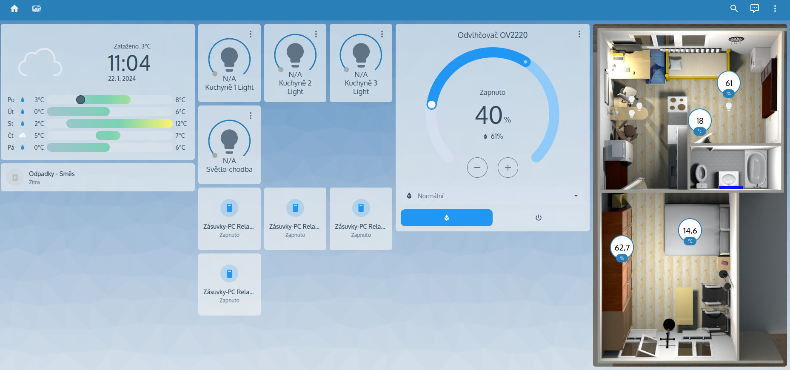

[](https://github.com/kuca171/home-assistant-config/commits/main)
[](https://github.com/home-assistant/core/releases/tag/2024.1.2)
[](https://community.home-assistant.io/u/kuca171/summary)



Dokumentace pro mé konfigurační soubory [Home Assistant](https://home-assistant.io/).

# Obsah

- [Historie](#historie)
- [Architektura](#architektura)
- [Použité zařízení](#použité-zařízení)
- [Hacs integrace a témata](#hacs-integrace-a-témata)
- [Automatizace](#automatizace)
- [Printscreeny dashboardu](#printscreeny-dashboardu)
- [Odkazy na mé další projekty](#odkazy-na-mé-další-projekty)

# Historie

Popsat začátky pokusů s arduinem, esp32/8266... node-red až po home assistant.

home assistant - docker supervisor
home assistant os
home assistant docker core

# Architektura

popsat architekturu sítě od routeru, přes wifi... 
dál načrtnout technologie esphome, zigbee, z2m, mqtt...

udělat na to nákresy/modely

# Použité zařízení

<!-- start-table -->

<table>
  <thead>
    <tr>
      <th>Server</th>
      <th>Počet kusů </th>
      <th>OS</th>
    </tr>
  </thead>
  <tbody>
    <tr>
      <td>Raspberry Pi 4 Model B - 2GB RAM</td>
      <td>1</td>
      <td>Debian GNU/Linux 11 (bullseye)</td>
    </tr>
    <tr>
      <td>Verbatim Vx500 SSD 120GB</td>
      <td>1</td>
      <td></td>
    </tr>
    <tr>
      <td>Home Assistant SkyConnect</td>
      <td>1</td>
      <td></td>
    </tr>
  </tbody>
  <thead>
    <tr>
      <th>Světla</th> 
      <th>Počet kusů</th>
      <th>Použitá integrace</th>
    </tr>
  </thead>
  <tbody>
    <tr>
      <td>Solight LED SMART WIFI RGB žárovka (wz432)</td>
      <td>3</td>
      <td><a href="https://github.com/rospogrigio/localtuya/"><s>local tuya</s></a><br /><a href="https://esphome.io/">ESPHome</a></td>
    </tr>
    <tr>
      <td>LEDVANCE SMART+ CL A60 E27 Tunable white</td>
      <td>1</td>
      <td><a href="https://www.zigbee2mqtt.io/devices/4058075729001.html#ledvance-4058075729001">Zigbee2mqtt</a></td>
    </tr>
  </tbody>
  <thead>
    <tr>
      <th>Zásuvky</th> 
      <th>Počet kusů</th>
      <th>Použitá integrace</th>
    </tr>
  </thead>
  <tbody>
    <tr>
      <td>Zásuvková lišta - LEDVANCE MULTI POWER SOCKET EU</td>
      <td>1</td>
      <td><a href="https://github.com/rospogrigio/localtuya/"><s>local tuya</s></a><br /><a href="https://esphome.io/">ESPHome</a></td>
    </tr>
  </tbody>
  <thead>
    <tr>
      <th>ESP</th>
      <th>Počet kusů</th>
      <th>Použitá integrace</th>
    </tr>
  </thead>
  <tbody>
    <tr>
      <td>ESP32 + BME280</td>
      <td>1</td>
      <td><a href="https://esphome.io/">ESPHome</a></td>
    </tr>
    <tr>
      <td>ESP32 (Bluetooth proxy)</td>
      <td>1</td>
      <td><a href="https://esphome.io/">ESPHome</a></td>
    </tr>
  </tbody>
  <thead>
    <tr>
      <th>Ostatní</th>
      <th>Počet kusů</th>
      <th>Použitá integrace</th>
    </tr>
  </thead>
  <tbody>
    <tr>
      <td>Odvlhčovač vzduchu Concept OV2220 Perfect Air Smart</td>
      <td>1</td>
      <td><a href="https://github.com/rospogrigio/localtuya/"><s>local tuya</s></a><br /><a href="https://github.com/make-all/tuya-local">Tuya local</a></td>
    </tr>
    <tr>
      <td>Pračka Beko Beyond FWUE 87262 CSH4B0</td>
      <td>1</td>
      <td><a href="https://github.com/home-assistant-HomeWhiz/home-assistant-HomeWhiz">HomeWhiz</a></td>
    </tr>
  </tbody>
</table>
<!-- end-table -->


# Hacs integrace a témata

Použité integrace a témata vzhledu z [HACS](https://hacs.xyz/):

<!-- start-table -->

<table>
  <thead>
    <tr>
      <th>Název</th>
    </tr>
  </thead>
  <tbody>
    <tr>
      <td><a href="https://github.com/home-assistant-HomeWhiz/home-assistant-HomeWhiz">HomeWhiz</a></td>
    </tr>
    <tr>
      <td><a href="https://github.com/make-all/tuya-local">Tuya Local</a></td>
    </tr>
  </tbody>
</table>

<!-- end-table -->

# Automatizace

```yaml
- id: '1695125949492'
  alias: Notifikace - odpadky
  description: Notifikace na vyvážení popelnic
  trigger:
  - platform: calendar
    event: start
    offset: 0:0:0
    entity_id: calendar.odpadky
  condition: []
  action:
  - device_id: 7a280933a6de48eafd2f52e43407db52
    domain: mobile_app
    type: notify
    message: '{{ states(''sensor.odpad_typ'') }}'
    title: Odpadky
  mode: single
- id: '1695126128511'
  alias: Notifikace - odvlhčovač
  description: Notifikace - odvlhčovač plná nádrž
  trigger:
  - platform: state
    entity_id:
    - binary_sensor.odvlhcovac_ov2220_tank
    from: 'off'
    to: 'on'
  condition: []
  action:
  - device_id: 7a280933a6de48eafd2f52e43407db52
    domain: mobile_app
    type: notify
    title: Odvlhčovač
    message: Plná nádrž
  mode: single
- id: '1695126213216'
  alias: Odvlhčovač - ranní spuštění
  description: Spuštění odvlhčovače každé ráno
  trigger:
  - platform: time
    at: 07:00:00
  condition: []
  action:
  - type: turn_on
    device_id: d3b9adc81b4e1490dd7dd77083bccce6
    entity_id: 8a419ebfe705e7e0798d9717e3ba49b7
    domain: humidifier
  mode: single
- id: '1695126309508'
  alias: Odvlhčovač - večerní vypnutí
  description: Vypnutí odvlhčovače každý večer
  trigger:
  - platform: time
    at: '20:00:00'
  condition: []
  action:
  - type: turn_off
    device_id: d3b9adc81b4e1490dd7dd77083bccce6
    entity_id: 8a419ebfe705e7e0798d9717e3ba49b7
    domain: humidifier
  mode: single
```

# Printscreeny dashboardu

nadpis mluví za vše

# Odkazy na mé další projekty

články z blogu?

local tuya integrace zařízení